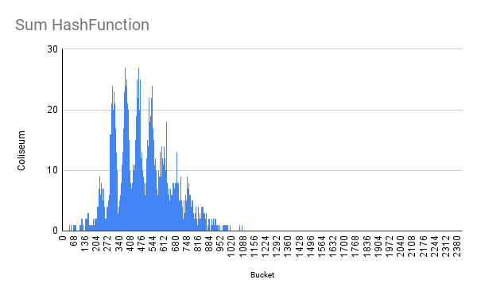

#  Хеш-таблица
## 1 часть. Написание хеш-таблицы.

Эта такая структура данных, которая позволяет организовать данные таким образом, что доступ к ним будет выполнятся фиксированное время. Множество объектов делится на некоторое количество непересекающихся подмножеств. Критерием разбиения является хеш-функция, которая возвращает номер подмножества. 

Принцип хеш-функции: 
элемент рассматривается как массив байт, хеш-функция проходится по этому массиву и определенным образом считает некоторое число (например, сумма ASCII-кодов символов). Затем номер списка, с которым проводится операция, вычисляется из остатка от деления хеша элемента на размер хеш-таблицы.

В данном пректе хеш-таблица представляет из себя:
        
1. Массив bucket'ов, то есть списков (реализацию я делал [в этом проекте](https://github.com/ask0later/List.git) ранее);
        
2. Размер хеш-таблицы, определяющийся числом этих списков. 

Количество элементов в bucket'е называется collision.

Вставка элемента при любой хеш-функции имеет алгоритмическую сложность О(1). 
Другое дело обстоит с удалением и поиском. Нужно пройтись по всему списку, чтобы найти элемент, который мы хотим удалить. Если хуш-функция "плохая", и большое количество элементов находится в одном списке, то сложность этих операций будет достигать О(n).

Чтобы лучше понять это, рассмотрим различные хеш-таблицы, и сравним их дисперсию(отклонение от среднего значения) и load-фактор(среднее количество элементов в списке среди непустых):

### ZeroHashFunction
Данная функция всегда возвращает число ноль. Следовательно все элементы будут находится в одном bucket'е.

Реализация функции:
~~~
size_t ZeroHash(char* /*buffer*/)
{
        return 0;
}
~~~


load-factor = 4679. dispersion = 458.


### FirstSymbolHashFunction
Данная функция возвращает ASCII-код первого символа.

Реализация функции:
~~~
size_t FirstHash(char* buffer)
{
        return (size_t) buffer[0];
}
~~~


load-factor = 167. dispersion = 100.


### LenghtHashFunction
Данная функция возвращает длину элемента.

Реализация функции:
~~~
size_t LenghtHash(char* buffer)
{
        return strlen(buffer);
}
~~~


load-factor = 334. dispersion = 164.


### SumHashFunction
Данная функция возвращает сумму ASCI-кодов символов.

Реализация функции:
~~~
size_t SumHash(char* buffer)
{
        size_t sum = 0;
        size_t   i = 0;
        while (buffer[i] != '\0')
        {
                sum += (size_t) buffer[i];
                i++;
        }
        return sum;
}
~~~


load-factor = 45. dispersion = 7.

На первый взляд эта функция имеет равномерное распределение, но давайте посмотрим как она будет себя вести, если увеличить размер хеш-таблици.

### SumHashFunction c большим размером хеш-таблици



Как видим, большинство bucket'ов не заполнено, поэтому функция не является подходящей.


### AverageHashFunction
Данная функция возвращает среднее число ASCI-кодов символов.

Реализация функции:
~~~
size_t AverageHash(char* buffer)
{
        size_t sum = 0;
        size_t   i = 0;
        while (buffer[i] != '\0')
        {
                sum += (size_t) buffer[i++];
        }

        return sum / i;
}
~~~


load-factor = 141. dispersion = 131.

### ROLHashFunction
Данная функция использует циклический сдвиг влево и XOR (исключающее или).

hash[i] = (hash[i - 1] << 1) XOR buffer[i]
~~~
size_t ROLHash(char* buffer)
{
        size_t hash = 0;

        for (size_t i = 0; buffer[i] != '\0'; i++)
        {
                hash = ROL(hash) ^ (size_t) buffer[i];
        }
        
        return hash;
}
~~~


load-factor = 45. dispersion = 6.

### RORHashFunction
Данная функция использует циклический сдвиг вправо и XOR (исключающее или).

hash[i] = (hash[i - 1] >> 1) XOR buffer[i]
~~~
size_t RORHash(char* buffer)
{
        size_t hash = 0;

        for (size_t i = 0; buffer[i] != '\0'; i++)
        {
                hash = ROR(hash) ^ (size_t) buffer[i];
        }

        return hash;
}
~~~


load-factor = 45. dispersion = 15.

Данная функция в сравнении с функцией, использующей циклический сдвиг влево, имеет такой же load-фактор, но большую dispersion.

### GNUHashFunction

~~~
size_t GNUHash(char* buffer)
{
        char* s = buffer;
        size_t h = 5381;

        for (unsigned char c = *s; c != '\0'; c = *++s)
                h = h + (h << 5) + c;

        return h;
}
~~~


load-factor = 45. dispersion = 6.


### CRC32

~~~
size_t CRC32Hash(char* buffer)
{
        unsigned int crc = 0xFFFFFFFF;
 
        size_t i = 0;
        while (buffer[i] != '\0')
        {                
                crc = (crc >> 8) ^ crc32_table[(crc ^ (unsigned int) buffer[i]) & 0xFF];
                i++;
        }

        return (size_t) crc ^ 0xFFFFFFFF;
}
~~~


### Сравнение хеш-функций
 
| Хеш-функции | ZeroHash | FirstHash | LenghtHash | SumHash | AverageHash | ROLHash | RORHash | GNUHash|  CRC32  |
| ------      | :------: | :-------: | :--------: | :-----: | :---------: | :-----: | :------:|:------:|:-------:|
| load-factor |   4679   |    167    |    334     |    45   |     141     |    45   |    45   |   45   |   45    |
| dispersion  |    458   |    100    |    164     |     7   |     131     |     6   |    15   |    6   |    6    |

Самым лучшим выбором хеш-функции будет ROLHash, GNUHash или CRC32.


## 2 часть. Оптимизация.

Прежде чем оптимизировать программу, необходимо понять, где находятся узкие места. Для этого я использую профилировщик ```callgrind```. Он показывает общее время выполнение функции и выполнение без учета вызовов других функций. 

Листинг программа без оптимизаций и с проверками выглядит так:


Хорошо видно, что обработка ошибок выполняется больше всех остальных функций. Поэтому отключим ее и добавим флаг компиляции ```-O3```.

### Base Line
Это станет нашей стартовой точкой, с которой мы будем сравнивать улучшение времени выполнения функций.


Видно, узкими местами программы являются функция поиска элемента в списке и функция вычисления хеша объекта.


### Оптимизация 1. Ассемблерная вставка.

Функция поиска вызывает из-под себя функцию сравнения элементов. Первоначально это ```strcmp```. Медленное выполнение происходит из-за того, что на вход могут подаваться объекты, сколь угодно большие и маленькие, этой функции надо рассматривать все варианты. Но в нашей задаче используются слова из литературы, и как мы видели раньше, длина всех слов не превосходит 16, поэтому под каждый объект будем выделять 16 байт (128 бит). Используя XMM-регистры (128 бит) ускорим сравнение элементов.

~~~
int InlineStrcmp(const char str_1[WORD_LENGTH], const char str_2[WORD_LENGTH])
{
    int result = 0;

    asm (".intel_syntax noprefix\n"
         "movdqu xmm1, XMMWORD PTR [%1]\n"
         "movdqu xmm2, XMMWORD PTR [%2]\n"
         "pcmpeqb xmm1, xmm2\n"
         "pmovmskb %0, xmm1\n"
         ".att_syntax prefix\n"
         : "=r" (result) : "r" (str_1), "r" (str_2) : "xmm1", "xmm2", "cc");

    return result;
}
~~~

После этого листинг прогрмаммы выглядит так:


Функция ```FindElem``` ускорилась почти в 3 раза (на 66%), ```CompleteHashTable``` - в 2 раза (на 49%).


### Оптимизация 2. SIMD.

Ускорить сравнение элементов можно другим способом, с помощью инструкции SIMD. 16 байт каждого объекта будем записывать в переменную __m128i, а затем сравнивать:

~~~
Iterator IntrinsicFindElem(List* list, Elem_t value)
{
    __m128i intr_value =  _mm_lddqu_si128((const __m128i*) value);
    
    Iterator elem_2 = {list, -1};

    for (Iterator it_1 = ListBegin(list), it_2 = ListEnd(list); it_1.index != it_2.index; it_1 = Next(&it_1))
    {
        Elem_t elem_1 = ListGetElem(&it_1);
        __m128i intr_elem_1 =  _mm_lddqu_si128((const __m128i*) elem_1);

        __m128i cmp = _mm_cmpeq_epi8(intr_elem_1, intr_value);

        int int_cmp = _mm_movemask_epi8(cmp);

        if (int_cmp == 65535)
        {
            elem_2 = it_1;   
            break;
        }
    }

    return elem_2;
}
~~~


После этого листинг прогрмаммы выглядит так:


Функция ```FindElem``` ускорилась почти в 3 раза (на 68%), ```CompleteHashTable``` - в 2 раза (на 51%).


### Оптимизация 3. Функция на ассемблере.

Из предыдущего листинга видно, что единственной не стандартной функцией осталась ```CRC32Hash```.

В ассемблере уже есть функция ```crc32```. Поэтому перепишем алгоритм при помощи этой инструкции. 

~~~
section .text
global AsmGetHashCRC32
AsmGetHashCRC32:
    xor rax, rax
    xor r10, r10
    
    .loop:
        crc32 eax, byte [rdi + r10]     
        inc r10
        cmp byte [rdi + r10], 0x00       
        jne .loop
    ret
~~~

После этого листинг прогрмаммы выглядит так:


Ассемблерная функция не отображается в листинге, скорее всего потому, что компилятор вставляет ее напрямую.

Количество тактов исполнения функции ```CompleteHashTable``` уменьшилось на ~2кк (на 0.3%).


### Итоги оптимизации.

Ясно, что оптимизация функции вычисления хеша элемента незначительно влияет на время выполнения всей программы. Это из-за того, что количество вызовов фунции ```CRC32Hash``` много меньше чем функции ```FindElem``` (31k и 15kk calls соответственно).


| Оптимизации   | Время выполняния, % |
| ------------- | :-------: |
| с проверками флаг -О0  | 1825 |
| без проверок флаг -О3 | 100 |
| inline strcmp |  51 |
|     SIMD      |  49 |
| CRC32 на ASM  | 48.7 |


Хотя у SIMD-инструкций время выполнения меньше, вызывать вместо ```strcmp``` - ```InlineStrcmp``` я считаю лучше, потому что код становится намного читабельным и понятным (из-за того, что мы меняем всего лишь одну функцию). 